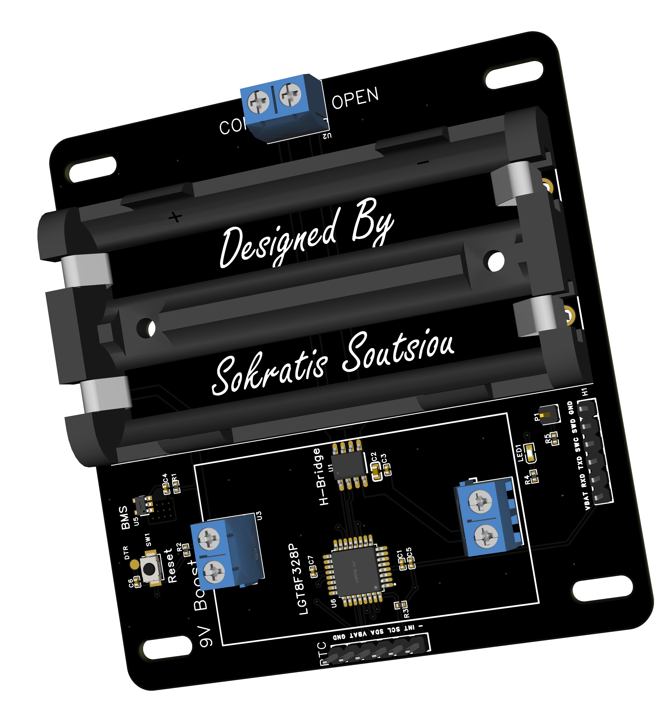

# latching-solenoid-irrigator
This is a simple custom PCB circuit that periodically switches a DC latching solenoid on and off. It includes a BMS for cell protection (XB5606AJ), the LGT8F328 (arduino clone), a temperature compensated RTC module (based on the DS3231), a 9V boost converter module (based on the XL6019E1) to power the 9V Hunter DC latching solenoid valve and an integrated H-bridge (RZ7889-MS) to switch the valve on or off. An aliexpress waterproof box is used with dimensions 115x90x55 mm.

